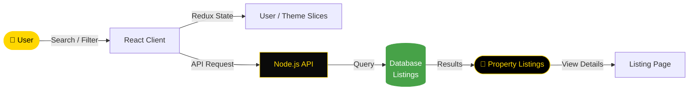

<div align="center">


[](https://git.io/typing-svg)

<br/>

<p align="center">
  <a href="https://github.com/NietoDeveloper">
    
  </a>
  <a href="https://committers.top/colombia#NietoDeveloper">
    
  </a>
  <a href="https://react.dev/">
    
  </a>
  <a href="https://nodejs.org/">
    
  </a>
  <a href="https://vitejs.dev/">
    
  </a>
  <a href="https://tailwindcss.com/">
    
  </a>
  <a href="https://opensource.org/licenses/MIT">
    
  </a>
</p>

<p align="center">
  <a href="https://github.com/NietoDeveloper/RealEstateFinder">
    
  </a>
</p>

</div>

---

## 📋 Overview

**Real Estate Finder** is a full-stack web application with separated frontend and backend, built using JavaScript, React, Node.js, Vite, and Tailwind CSS. Designed to let users browse and search property listings through a clean, responsive interface backed by a dedicated RESTful API.

---

## 🗂️ Project Structure

```text
RealEstateFinder/
├── api/                  # Node.js backend for API services
│   ├── controllers/       # Business logic handlers
│   ├── models/             # Database models
│   ├── routes/              # RESTful API endpoints
│   └── utils/                # Helper functions
└── client/               # React frontend built with Vite
    ├── public/
    └── src/
        ├── assets/
        ├── components/
        ├── pages/
        └── redux/
            ├── theme/
            └── user/
```

---

## 🔄 Property Search Flow



---

## 🛠️ Technology Stack

<div align="center">

| Layer | Technologies |
|:------|:-------------|
| 🎨 **Frontend** | React, Vite, Tailwind CSS |
| ⚙️ **Backend** | Node.js, Express (or preferred framework) |
| 🧠 **State** | Redux (user, theme) |
| 🔧 **Version Control** | Git / GitHub |

</div>

---

## 🚀 Getting Started

### Prerequisites

- Node.js (v16 or higher)
- npm or yarn

### Installation

**Step 1 — Clone the repository**

```bash
git clone https://github.com/NietoDeveloper/RealEstateFinder
cd RealEstateFinder
```

**Step 2 — Install frontend dependencies**

```bash
cd client
npm install
```

**Step 3 — Install backend dependencies**

```bash
cd ../api
npm install
```

### Running the Application

**Start the backend**

```bash
cd api
npm start
```

The backend runs on `http://localhost:3000` by default.

**Start the frontend**

```bash
cd client
npm run dev
```

The frontend runs on `http://localhost:5173` by default (Vite's default port).

---

## 🧑‍💻 Development

- **Frontend:** Uses React with Vite for fast development and Tailwind CSS for styling.
- **Backend:** Node.js with Express (or your preferred framework) for API endpoints.
- **Environment Variables:** Create `.env` files in `/client` and `/api` for configuration (e.g., API URLs, ports).

---

## 📦 Build for Production

**Build the frontend**

```bash
cd client
npm run build
```

Outputs to `/client/dist`.

**Serve the backend**

Ensure the backend is configured to serve the frontend's static files if needed.

---

## 👨‍💻 Author

**Manuel Nieto (NietoDeveloper)**
Software Developer
GitHub: [@NietoDeveloper](https://github.com/NietoDeveloper)

---

## 📄 License

This project is licensed under the **MIT License**.

<div align="center">

<br/>


</div>
