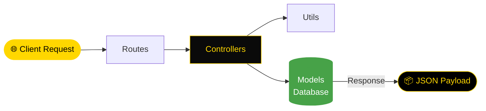

<div align="center">


[](https://git.io/typing-svg)

<br/>

<p align="center">
  <a href="https://nodejs.org/">
    
  </a>
  <a href="https://expressjs.com/">
    
  </a>
  <a href="https://opensource.org/licenses/MIT">
    
  </a>
</p>

<p align="center">
  <a href="https://github.com/NietoDeveloper/RealEstateFinder">
    
  </a>
</p>

</div>

---

## 📋 Overview

The **API** service for **Real Estate Finder**. Built with **Node.js**, it exposes RESTful endpoints handling property listings and user data, following a clean, modular architecture that separates routing, business logic, data models, and utility functions.

---

## 🗂️ Directory Structure

```text
api/
├── controllers/     # Business logic handlers for listings and users
├── models/          # Database schemas and data models
├── routes/          # RESTful API endpoint definitions
└── utils/           # Helper functions and shared utilities
```

---

## 🔄 Request Flow



---

## ⚙️ Core Modules

- **Controllers:** Handle business logic for property listings and user operations.
- **Models:** Define the data structures for listings and users.
- **Routes:** Expose RESTful endpoints consumed by the client application.
- **Utils:** Shared helper functions used across controllers.

---

## 🛠️ Tech Stack

<div align="center">

| Layer | Technologies |
|:------|:-------------|
| 🏃 **Runtime** | Node.js |
| ⚙️ **Framework** | Express (or preferred framework) |
| 🔧 **Version Control** | Git / GitHub |

</div>

---

## 🚀 Getting Started

### Prerequisites

- Node.js (v16 or higher)
- npm or yarn

### Installation & Execution

**Step 1 — Navigate to the API directory**

```bash
cd api
```

**Step 2 — Install dependencies**

```bash
npm install
```

**Step 3 — Configure environment variables**

Create a `.env` file in the `api` directory with your database connection string, port, and other required variables.

**Step 4 — Start the server**

```bash
npm start
```

The API runs on `http://localhost:3000` by default.

---

## 👨‍💻 Author

**Manuel Nieto (NietoDeveloper)**
Software Developer
GitHub: [@NietoDeveloper](https://github.com/NietoDeveloper)

---

## 📄 License

This project is licensed under the **MIT License**.

<div align="center">

<br/>


</div>


<div align="center">


[](https://git.io/typing-svg)

<br/>

<p align="center">
  <a href="https://nodejs.org/">
    
  </a>
  <a href="https://expressjs.com/">
    
  </a>
  <a href="https://opensource.org/licenses/MIT">
    
  </a>
</p>

<p align="center">
  <a href="https://github.com/NietoDeveloper/RealEstateFinder">
    
  </a>
</p>

</div>

---

## 📋 Overview

The **API** service for **Real Estate Finder**. Built with **Node.js**, it exposes RESTful endpoints handling property listings and user data, following a clean, modular architecture that separates routing, business logic, data models, and utility functions.

---

## 🗂️ Directory Structure

```text
api/
├── controllers/     # Business logic handlers for listings and users
├── models/          # Database schemas and data models
├── routes/          # RESTful API endpoint definitions
└── utils/           # Helper functions and shared utilities
```

---

## 🔄 Request Flow


---

## ⚙️ Core Modules

- **Controllers:** Handle business logic for property listings and user operations.
- **Models:** Define the data structures for listings and users.
- **Routes:** Expose RESTful endpoints consumed by the client application.
- **Utils:** Shared helper functions used across controllers.

---

## 🛠️ Tech Stack

<div align="center">

| Layer | Technologies |
|:------|:-------------|
| 🏃 **Runtime** | Node.js |
| ⚙️ **Framework** | Express (or preferred framework) |
| 🔧 **Version Control** | Git / GitHub |

</div>

---

## 🚀 Getting Started

### Prerequisites

- Node.js (v16 or higher)
- npm or yarn

### Installation & Execution

**Step 1 — Navigate to the API directory**

```bash
cd api
```

**Step 2 — Install dependencies**

```bash
npm install
```

**Step 3 — Configure environment variables**

Create a `.env` file in the `api` directory with your database connection string, port, and other required variables.

**Step 4 — Start the server**

```bash
npm start
```

The API runs on `http://localhost:3000` by default.

---

## 👨‍💻 Author

**Manuel Nieto (NietoDeveloper)**
Software Developer
GitHub: [@NietoDeveloper](https://github.com/NietoDeveloper)

--