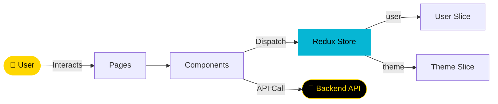

<div align="center">


[](https://git.io/typing-svg)

<br/>

<p align="center">
  <a href="https://react.dev/">
    
  </a>
  <a href="https://nodejs.org/">
    
  </a>
  <a href="https://vitejs.dev/">
    
  </a>
  <a href="https://tailwindcss.com/">
    
  </a>
  <a href="https://opensource.org/licenses/MIT">
    
  </a>
</p>

<p align="center">
  <a href="https://github.com/NietoDeveloper/RealEstateFinder/tree/main/client">
    
  </a>
</p>

</div>

---

## 📋 Project Overview

This is the frontend of **Real Estate Finder**, built with **React**, **Node.js**, **Vite**, and **Tailwind CSS**. It provides a modern, responsive user interface with fast development and build times.

---

## 🗂️ Project Structure

```text
client/
├── public/            # Static assets served directly
└── src/
    ├── assets/          # Static files (images, fonts, etc.)
    ├── components/       # Reusable React components
    ├── pages/             # Page-level components
    └── redux/             # Global state management
        ├── theme/           # Theme state slice
        └── user/             # User state slice
```

---

## 🔄 App Data Flow



---

## 🛠️ Tech Stack

<div align="center">

| Technology | Role |
|:-----------|:-----|
| **React** | JavaScript library for building user interfaces |
| **Node.js** | Runtime for development and build processes |
| **Vite** | Fast build tool and development server |
| **Tailwind CSS** | Utility-first CSS framework for styling |

</div>

---

## 🚀 Getting Started

### Prerequisites

- Node.js (v16 or higher)
- npm or yarn

### Setup Instructions

**Step 1 — Clone the repository**

```bash
git clone https://github.com/NietoDeveloper/RealEstateFinder
cd RealEstateFinder/client
```

**Step 2 — Install dependencies**

```bash
npm install
```

**Step 3 — Start the development server**

```bash
npm run dev
```

The app will be available at `http://localhost:5173`.

---

## 📦 Build Instructions

To create a production build:

```bash
npm run build
```

Output will be in the `dist` folder.

---

## 📜 Scripts

| Command | Description |
|:--------|:-------------|
| `npm run dev` | Starts the development server |
| `npm run build` | Builds the app for production |
| `npm run preview` | Previews the production build locally |

---

## 🎨 Tailwind CSS Usage

- Tailwind is configured in `tailwind.config.js`.
- Apply styles using utility classes directly in JSX.
- Custom styles can be added in `src/styles/tailwind.css`.

---

## 🧑‍💻 Development Notes

- Use JSX for React components.
- Avoid `<form>` `onSubmit` due to sandbox restrictions; use button event handlers instead.
- Use `className` instead of `class` in JSX for Tailwind classes.
- Ensure components are reusable and modular.

---

## ▶️ Running the App

- **Development:** `npm run dev` for hot-reloading.
- **Production:** Serve the `dist` folder using a static server (e.g., `npm run preview`).

---

## 👨‍💻 Author

**Manuel Nieto** — Software Developer
GitHub: [@NietoDeveloper](https://github.com/NietoDeveloper)

---

## 📄 License

This project is licensed under the **MIT License**.

<div align="center">

<br/>


</div>
